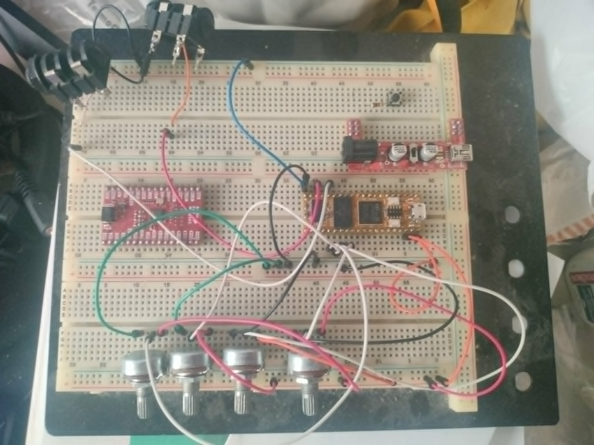
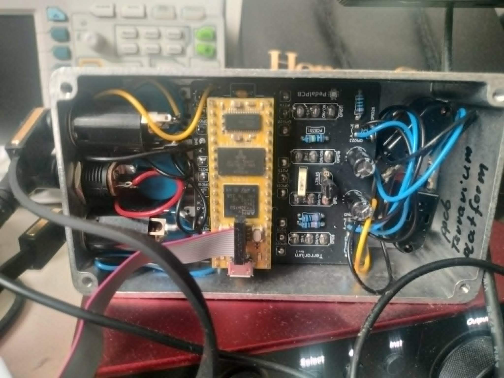

# BasicDaisy
A bare bones daisy seed based project with absolute minimum features to support digital audio effects development in C++23.

The motivation for this setup is the fact that I wanted a cheap STM dev board with external RAM. After some research I went with Daisy Seed board. Obviously the Electrosmith daisy codebase is intended to support their whole line of products which was not my use case. Also their whole setup is C++17 and I wanted to have something working with C++23 to have an opportunity to learn the newer features.

The project contains the basic stuff (maybe a few more) from original Daisy codebase that are required to develop an effect pedal(potensiometers, audio passthrough). 
 Project uses arm-none-eabi 14.3.1 version so it can be used with C++23.

## Software guidelines:

#### Using cmake:
cd build  
cmake .. -DCMAKE_BUILD_TYPE=Debug/Release  
make clean  
make  
To flash: make program  

#### Testing with google test
cd test  
cmake -S . -B build  
cmake --build build  
cd build && ctest 

All work from parent project folder. Debugging works perfectly with VsCode Cortex M debug Addon by marus25. For now, I guess gdb scripts are out of the question.

Maybe I will do a non-HAL version. Pending to see how tests work with hardware dependencies. 

Blink led @ 12c2cb8e7459371a14212ea0384d66e50286da91. I will add the effects I make in main branch.

### Hardware

Not so recently I moved from a breadboard set-up to a pedal format. Below is the breadboard setup I used in initial bringup for historic reference.

Now I use this pedal format which is a ready solution (needs soldering and assembly) that can be found here: [Bausatz Pedal](https://www.musikding.de/Terrarium-Platform-Bausatz_1). Pedal has a little bit noise but is a lot quieter than my breadboard. Another dissapointment is that while the design could be easily stereo they have not implemented it. There are other pedal formats out there that use daisy seed and I may try in the future, or come up with my own if I have the time. Picture of my current setup below.

